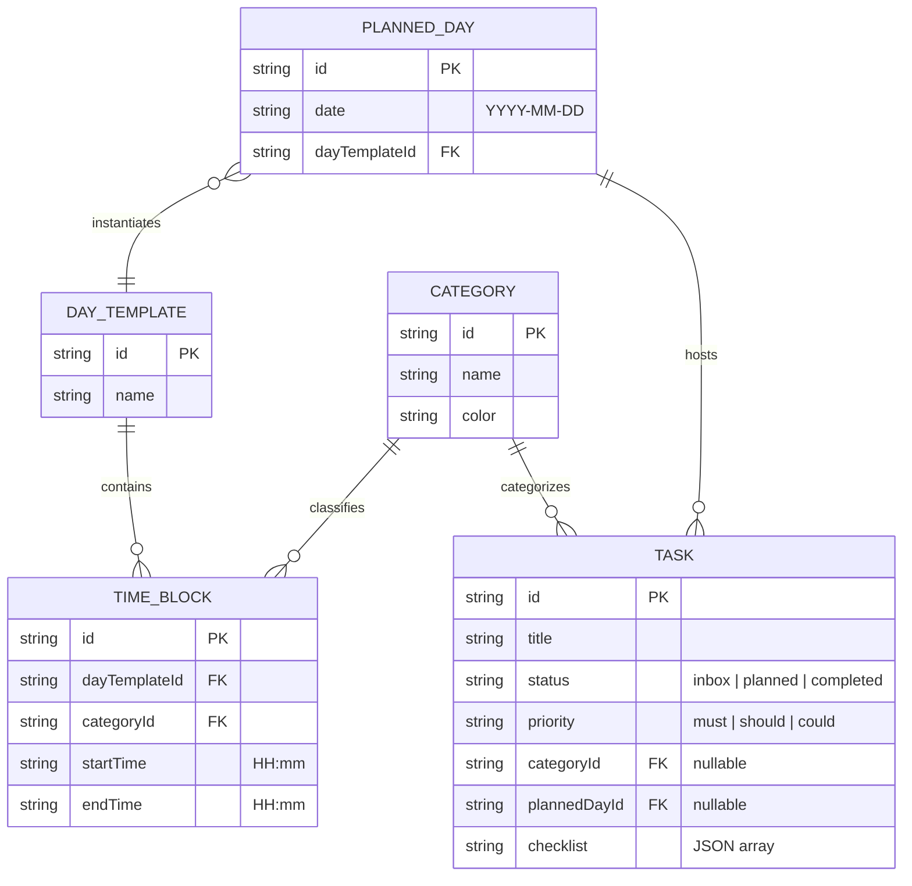

# Architecture Spine — RouteIn

## Design Paradigm

**Local-First Single Page Application (SPA / PWA)**
L'application est exécutée entièrement dans le navigateur du client sans aucun backend (ni serveur d'API, ni base de données distante). L'état est géré localement (IndexedDB via Dexie.js). Le paradigme garantit des temps de réponse instantanés (Zéro latence), une confidentialité totale, et une indépendance réseau absolue.

## Invariants & Rules

### AD-1 — Single Source of Truth Locale
- **Binds:** Couche de stockage de données.
- **Prevents:** La perte de données due aux purges de cache navigateur, et la désynchronisation de l'état.
- **Rule:** Toutes les écritures de données métiers se font via Dexie.js (IndexedDB). Le LocalStorage ne doit être utilisé *que* pour les préférences non critiques de l'UI (ex: dernier onglet ouvert). La fonction d'export JSON manuel doit sérialiser l'intégralité des tables Dexie.

### AD-2 — Planification Manuelle Isolée
- **Binds:** Logique d'affectation temporelle.
- **Prevents:** L'implémentation d'un moteur de récurrence infinie complexe ou imprévisible.
- **Rule:** Le système ne génère jamais de `PlannedDay` (Journée réelle) dans le futur de façon autonome. La planification résulte exclusivement d'une action explicite (duplication de semaine) liant une Date à un `DayTemplate`.

### AD-3 — Repli vers le Dépôt (Fallback)
- **Binds:** Moteur d'amnésie bienveillante (Saut de cycle).
- **Prevents:** La perte silencieuse de tâches ou le plantage du moteur lorsqu'une catégorie n'est plus planifiée dans le calendrier.
- **Rule:** Lors du report automatique d'une tâche, si le système ne trouve aucun `TimeBlock` (Plage horaire) correspondant à la catégorie de la tâche dans les `PlannedDay` futurs existants, la tâche est immédiatement réassignée au statut "Dépôt" (Inbox) et détachée du calendrier.

### AD-4 — Tâches Minimalistes (Pas de gestion du temps intra-tâche)
- **Binds:** Modèle de données de la Tâche (`TASK`).
- **Prevents:** La création d'un moteur de récurrence complexe ou d'un gestionnaire d'échéances anxiogène qui contredirait l'amnésie bienveillante.
- **Rule:** L'entité `TASK` ne contient intentionnellement aucun champ `duration`, `dueTime`, ou `recurrence`. La notion de temps n'existe qu'au niveau des conteneurs (`TIME_BLOCK`), les tâches elles-mêmes sont intemporelles.

### AD-5 — Migrations de schéma versionnées et récupérables
- **Binds:** Couche de stockage Dexie (versions `db.version(n)`) et amorçage de l'application.
- **Prevents:** Une base locale rendue définitivement illisible par une migration qui échoue (typiquement un index unique posé sur des données non conformes), laissant l'application bloquée sans recours sur un écran vide.
- **Rule:** Les migrations Dexie sont versionnées et additives — on ne réécrit jamais le sens d'une version déjà livrée. Une contrainte d'unicité (`&index`) et le nettoyage de données qui la rend satisfiable doivent vivre dans **deux versions consécutives distinctes** (nettoyage en version N, `&index` en N+1) : Dexie construit et valide l'index **avant** d'exécuter le `.upgrade()` de la même version, donc un nettoyage placé dans la même version que la contrainte s'exécuterait trop tard. L'amorçage gâte explicitement sur `db.open()` ; tout échec d'ouverture affiche un écran de récupération permettant de réinitialiser la base locale, afin qu'aucune migration avortée ne bloque l'application silencieusement.

## Consistency Conventions

| Concern | Convention |
| --- | --- |
| Naming (entities, files, interfaces) | camelCase pour les propriétés DB, PascalCase pour les composants React. |
| Data & formats (ids, dates, checklists) | IDs : UUID v4. Dates : format ISO-8601 (`YYYY-MM-DD`). Checklists stockées en tant que structure JSON simple dans la tâche. |
| State & cross-cutting | Mutation d'état via requêtes Dexie réactives (`useLiveQuery`) qui redessinent l'UI automatiquement au moindre changement local. |

## Stack

| Name | Version |
| --- | --- |
| Vite | 8.x |
| React | 19.x |
| Dexie.js | 4.x |
| vite-plugin-pwa | 0.x |
| Vanilla CSS | N/A |

## Deployment & Hosting

Puisque l'application n'a pas de backend et si le code est publié en Open Source sur GitHub :

- **Hébergeur :** GitHub Pages.
- **Déploiement :** Automatique via GitHub Actions (totalement gratuit et illimité pour les dépôts publics). À chaque modification du code (push), GitHub compile l'application React/Vite et la met en ligne.
- **Distribution PWA :** Les utilisateurs accèdent à l'URL `pseudo.github.io/RouteIn` via le navigateur mobile et cliquent sur "Ajouter à l'écran d'accueil" pour l'installer.

## Structural Seed

## Deferred

- **Intégration `vite-plugin-pwa` (Manifest & Service Worker) :** Bien que l'application soit conçue comme une PWA (Local-first), l'implémentation formelle du manifest web et du Service Worker (pour l'installabilité et le cache des assets hors-ligne) est repoussée à la fin du projet (Epic 4 ou ultérieur) afin de se concentrer d'abord sur la logique métier.
- **Stratégie de migration de schéma (Dexie Migrations) :** ~~Repoussé~~ → **Promue hors de « Deferred » depuis Epic 2**, voir l'invariant **AD-5**. Les migrations Dexie versionnées sont désormais actives (plusieurs versions avec `.upgrade()` de nettoyage). L'export/import JSON reste un filet de sécurité complémentaire, pas un substitut aux migrations.
- **Service Worker pour Push Notifications locales :** L'UI réactive suffit pour le moment ; le système de notifications Push natives est repoussé à une v2 pour limiter la complexité de lancement.
